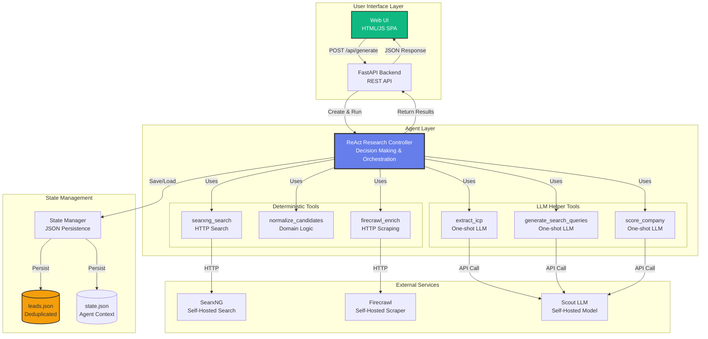
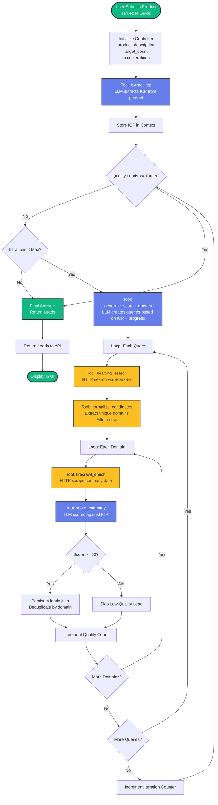
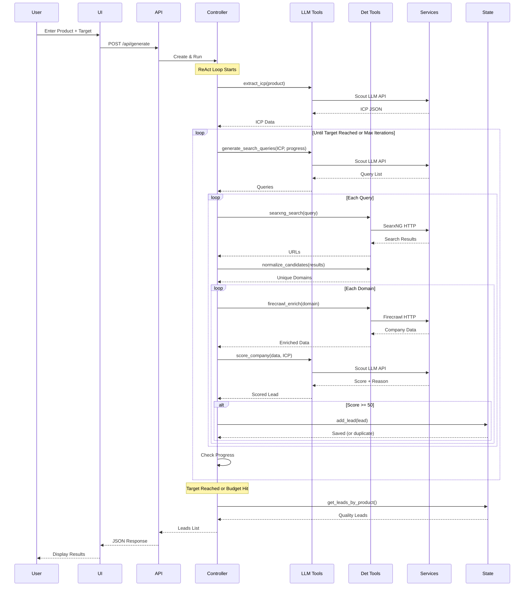
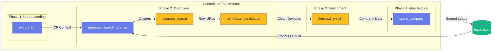

# Lead Generator AI Agent - Architecture & Flow Diagrams

## System Architecture



## ReAct Controller Flow



## Data Flow Architecture



## Tool Interaction Pattern



## Component Responsibilities

### 🎯 ReAct Controller
**Role:** Decision-making and orchestration  
**Responsibilities:**
- Track progress toward target lead count
- Decide when to search more vs. stop
- Generate reasoning for each action
- Manage iteration budget
- Coordinate tool execution

**Why ReAct?**
- **Thought:** Reasons about current state and next action
- **Action:** Invokes appropriate tool
- **Observation:** Processes tool result
- **Loop:** Repeats until goal met

### 🧠 LLM Helper Tools (3)

**1. extract_icp**
- **Input:** Product description (string)
- **Process:** One-shot LLM call
- **Output:** ICP JSON (industries, regions, size, roles, pain points)

**2. generate_search_queries**
- **Input:** ICP JSON + current progress
- **Process:** One-shot LLM call
- **Output:** Array of search query strings

**3. score_company**
- **Input:** Company data JSON + ICP JSON
- **Process:** One-shot LLM call with scoring criteria
- **Output:** Score (0-100) + fit label + reasoning

### ⚙️ Deterministic Tools (3)

**1. searxng_search**
- **Input:** Query string
- **Process:** HTTP GET to SearxNG
- **Output:** List of {url, title, snippet}

**2. normalize_candidates**
- **Input:** Search results JSON
- **Process:** Domain extraction, filtering, deduplication
- **Output:** List of unique valid domains

**3. firecrawl_enrich**
- **Input:** Domain string
- **Process:** HTTP POST to Firecrawl with schema
- **Output:** Structured company data (name, description, contacts)

### 💾 State Management

**Persistence:**
- `leads.json` - All discovered leads (deduplicated by domain)
- [state.json](file:///c:/Users/JayantVerma/AA/SSH_AGENT/SOLO_AGENTS/SalesAgent/v19-backup/v19/salesagent-pop-ews-new/rag_state.json) - Agent context (optional checkpointing)

**Deduplication:**
- Domain-based (case-insensitive)
- Prevents duplicate company entries
- Preserves highest-scored version

## Key Design Principles

### 1. Single Controller Pattern
```
❌ NOT: Separate agents for ICP, search, scoring
✅ YES: One controller orchestrates all tools
```

**Benefits:**
- Unified reasoning stream
- Central progress tracking
- Simpler debugging
- Better stopping logic

### 2. Tool Categorization
```
🧠 LLM Tools: Need reasoning (ICP, queries, scoring)
⚙️ Deterministic: Pure HTTP/logic (search, normalize, enrich)
```

**Benefits:**
- Clear separation of concerns
- Easy to test independently
- No LLM calls in data operations

### 3. Progressive Refinement
```
Iteration 1: Broad queries → Some leads
Iteration 2: Refined queries → More targeted leads
Iteration N: Stop when target reached
```

**Benefits:**
- Better coverage
- Quality improves over iterations
- Budget-aware termination

## Presentation Talking Points

### Problem Statement
- Manual lead research is time-consuming
- Sales teams need qualified leads, not just lists
- Scalability requires automation

### Solution
- AI-powered research controller
- Autonomous search-enrich-score cycle
- Self-hosted for data privacy

### Technical Innovation
1. **ReAct Pattern** - Reasoning + Action loop
2. **Hybrid Tools** - LLM for reasoning, HTTP for data
3. **Progressive Discovery** - Refines strategy based on results

### Differentiators
- ✅ No SaaS dependencies (fully self-hosted)
- ✅ Deduplication prevents wasted effort
- ✅ Scored leads (not just raw lists)
- ✅ Extensible (add CRM, email, LinkedIn tools)

### Demo Flow
1. Show UI with product input
2. Explain ReAct controller reasoning
3. Display live search → enrich → score cycle
4. Present scored leads with reasoning
5. Export to CRM (future enhancement)

## Success Metrics

**Quality:**
- % of leads with relevance score >= 80
- Contact info completeness (email, phone)

**Efficiency:**
- Time to generate N leads
- Cost per lead (LLM tokens + compute)

**Coverage:**
- Domain diversity (not just G2 listings)
- Geographic distribution match to ICP
