# 🤖 LeadGenAgent - Agent Execution Flow

## Overview
Detailed visualization of the ReAct agent's decision-making process, tool execution patterns, and lead generation workflow.

---

## 🔄 Complete Agent Flow (End-to-End)

```mermaid
flowchart TD
    Start([User Clicks Generate Leads]) --> SelectProduct[Select Product from Dropdown]
    SelectProduct --> APICall[POST /api/generate/stream<br/>product_id + product_name]
    
    APICall --> InitController[Initialize LeadResearchController<br/>with product context]
    InitController --> CreateAgent[Create ReAct Agent<br/>Inject system prompt]
    CreateAgent --> SetupTools[Load Tools:<br/>search, scrape, email, score, save]
    
    SetupTools --> StartLoop{Start ReAct Loop<br/>Iteration 0}
    
    StartLoop --> Thought1[💭 THOUGHT<br/>LLM: Analyze current state<br/>Plan next action]
    
    Thought1 --> StreamThought[📡 Stream to UI<br/>SSE: thought event]
    StreamThought --> Action1[⚙️ ACTION<br/>LLM: Select tool + inputs<br/>e.g., searxng_search]
    
    Action1 --> StreamAction[📡 Stream to UI<br/>SSE: action event]
    StreamAction --> CheckTool{Which Tool?}
    
    CheckTool -->|Search| SearchTool[🔍 searxng_search<br/>Query: "AI infrastructure companies"]
    CheckTool -->|Scrape| ScrapeTool[🌐 firecrawl_enrich<br/>domain, extract emails]
    CheckTool -->|Score| ScoreTool[📊 score_company<br/>ICP matching via LLM]
    CheckTool -->|Save| SaveTool[💾 save_lead_tool<br/>MongoDB with product_id]
    CheckTool -->|Complete| CompleteTool[🏁 complete_task<br/>End generation]
    
    SearchTool --> Observation1[👁️ OBSERVATION<br/>Results from tool]
    ScrapeTool --> Observation1
    ScoreTool --> Observation1
    SaveTool --> LeadEvent[📡 Stream to UI<br/>SSE: lead event]
    
    LeadEvent --> Observation1
    
    Observation1 --> StreamObs[📡 Stream to UI<br/>SSE: observation event]
    StreamObs --> Increment{Iteration++<br/>< max_iterations?}
    
    Increment -->|Yes| Thought1
    Increment -->|No| ForceComplete[⚠️ Max iterations reached<br/>Force completion]
    
    CompleteTool --> CompleteEvent[📡 Stream to UI<br/>SSE: complete event<br/>quality_saved count]
    ForceComplete --> CompleteEvent
    
    CompleteEvent --> CloseSSE[Close SSE Stream]
    CloseSSE --> End([UI Shows Completion])
    
    style Start fill:#667eea,color:#fff
    style Thought1 fill:#f093fb,color:#fff
    style Action1 fill:#764ba2,color:#fff
    style Observation1 fill:#4bc0c0,color:#fff
    style CompleteTool fill:#10b981,color:#fff
    style End fill:#667eea,color:#fff
```

---

## 🧠 ReAct Agent Decision Loop


---

## 🛠️ Tool Execution Workflows

### 1. Search Tool Flow

```mermaid
sequenceDiagram
    participant Agent
    participant SearchTool as searxng_search
    participant SearXNG
    
    Agent->>SearchTool: searxng_search(<br/>query="AI DevOps companies",<br/>max_results=10<br/>)
    
    SearchTool->>SearXNG: GET /search?q=AI+DevOps+companies
    SearXNG-->>SearchTool: HTML results page
    
    SearchTool->>SearchTool: Parse HTML<br/>Extract domains, titles, snippets
    SearchTool->>SearchTool: Deduplicate by domain
    SearchTool->>SearchTool: Limit to max_results
    
    SearchTool-->>Agent: [<br/>{domain, title, snippet},<br/>{domain, title, snippet},<br/>...<br/>]
    
    Agent->>Agent: 👁️ Observation:<br/>"Found 10 companies"
```



---

### 2. Firecrawl Enrichment Flow


---

### 3. Company Scoring Flow

```mermaid
sequenceDiagram
    participant Agent
    participant ScoreTool as score_company
    participant LLM as OpenAI GPT-4
    
    Agent->>ScoreTool: score_company(<br/>company_data_json,<br/>icp_json<br/>)
    
    ScoreTool->>ScoreTool: Parse company data<br/>(domain, description, industry)
    ScoreTool->>ScoreTool: Parse ICP<br/>(target industries, pain points, buyer roles)
    
    ScoreTool->>ScoreTool: Build scoring prompt:<br/>"Analyze if company matches ICP..."
    
    ScoreTool->>LLM: ChatCompletion API<br/>Prompt + structured output
    
    LLM-->>ScoreTool: {<br/>"relevance_score": 85,<br/>"fit_label": "high",<br/>"short_reason": "Perfect match..."<br/>}
    
    ScoreTool->>ScoreTool: Validate score (0-100)
    ScoreTool->>ScoreTool: Validate fit_label<br/>(low/medium/high)
    
    ScoreTool-->>Agent: {<br/>"relevance_score": 85,<br/>"fit_label": "high",<br/>"short_reason": "..."<br/>}
    
    Agent->>Agent: 👁️ Observation:<br/>"Score: 85/100 (high)"
    
    alt Score >= 65 AND fit == "high"
        Agent->>Agent: 💭 Thought:<br/>"This is a quality lead, save it"
        Agent->>Agent: ⚙️ Action: save_lead_tool
    else Score < 65 OR fit != "high"
        Agent->>Agent: 💭 Thought:<br/>"Not a good match, continue searching"
        Agent->>Agent: ⚙️ Action: searxng_search
    end
```



---

### 4. Save Lead Flow


---

## 📊 Agent State Management


---

## 🎯 Quality Lead Filtering Logic

```mermaid
flowchart TD
    Start[Company Data Received] --> ExtractInfo[Extract:<br/>- Domain<br/>- Description<br/>- Industry<br/>- Emails]
    
    ExtractInfo --> Score[Call score_company tool]
    Score --> GetScore[Receive:<br/>- relevance_score 0-100<br/>- fit_label low/medium/high<br/>- reasoning]
    
    GetScore --> CheckScore{Score >= 65?}
    
    CheckScore -->|No| Reject1[❌ Reject:<br/>Score too low]
    CheckScore -->|Yes| CheckFit{Fit == "high"?}
    
    CheckFit -->|No| Reject2[❌ Reject:<br/>Fit not optimal]
    CheckFit -->|Yes| CheckEmails{Has emails?}
    
    CheckEmails -->|No| Reject3[❌ Reject:<br/>No contact info]
    CheckEmails -->|Yes| CheckEmailQuality{Email confidence<br/>>= 60%?}
    
    CheckEmailQuality -->|No| Reject4[❌ Reject:<br/>Low email quality]
    CheckEmailQuality -->|Yes| QualityLead[✅ QUALITY LEAD<br/>Save to MongoDB]
    
    QualityLead --> AddProduct[Tag with product_id<br/>+ product_name]
    AddProduct --> SaveDB[(MongoDB Insert)]
    SaveDB --> StreamUI[📡 Stream lead to UI<br/>SSE: lead event]
    
    Reject1 --> SearchMore[Continue searching]
    Reject2 --> SearchMore
    Reject3 --> SearchMore
    Reject4 --> SearchMore
    
    SearchMore --> CheckIterations{More iterations<br/>remaining?}
    CheckIterations -->|Yes| Start
    CheckIterations -->|No| Complete[🏁 Complete Task]
    
    style QualityLead fill:#10b981,color:#fff
    style Reject1 fill:#ef4444,color:#fff
    style Reject2 fill:#ef4444,color:#fff
    style Reject3 fill:#ef4444,color:#fff
    style Reject4 fill:#ef4444,color:#fff
    style Complete fill:#667eea,color:#fff
```

**Quality Criteria:**
1. ✅ Relevance Score >= 65/100
2. ✅ Fit Label == "high"
3. ✅ Has valid email addresses
4. ✅ Email confidence >= 60%

---

## 🔁 Iteration Management

```mermaid
gantt
    title Agent Iteration Timeline (Max 5 Iterations)
    dateFormat X
    axisFormat %s
    
    section Iteration 1
    Thought 1: 0, 2
    Action: searxng_search: 2, 5
    Observation: Results: 5, 6
    
    section Iteration 2
    Thought 2: 6, 8
    Action: firecrawl_enrich: 8, 15
    Observation: Enriched data: 15, 16
    
    section Iteration 3
    Thought 3: 16, 18
    Action: score_company: 18, 22
    Observation: Score 85: 22, 23
    
    section Iteration 4
    Thought 4: 23, 25
    Action: save_lead_tool: 25, 27
    Observation: Lead saved: 27, 28
    
    section Iteration 5
    Thought 5: 28, 30
    Action: complete_task: 30, 31
    Task Complete: 31, 32
```

**Iteration Limits:**
- **Max Iterations**: 5 (configurable via `max_iterations`)
- **Target Count**: 30 leads (configurable via `target_count`)
- **Early Termination**: Agent calls `complete_task` when satisfied
- **Forced Termination**: System stops after max iterations

---

## 📡 Real-Time Streaming Events


**SSE Event Types:**
- `step`: Agent thought/action/observation
- `lead`: New lead discovered and saved
- `complete`: Generation finished
- `error`: Execution error

---

## 🧩 Tool Dependencies Graph


---

## 🎬 Example Execution Trace

```mermaid
sequenceDiagram
    autonumber
    
    participant Agent
    participant Search as searxng_search
    participant Scrape as firecrawl_enrich
    participant Score as score_company
    participant Save as save_lead_tool
    participant Complete as complete_task
    
    Note over Agent: 💭 Thought: "I need to search for AI infrastructure companies"
    Agent->>Search: query="AI infrastructure companies", max_results=10
    Search-->>Agent: 👁️ Observation: Found 10 companies
    
    Note over Agent: 💭 Thought: "Let me enrich the first company: acme.com"
    Agent->>Scrape: domain="acme.com"
    Scrape-->>Agent: 👁️ Observation: {name: "Acme AI", emails: [...], description: "..."}
    
    Note over Agent: 💭 Thought: "Evaluate if Acme AI matches our ICP"
    Agent->>Score: company_data={...}, icp={...}
    Score-->>Agent: 👁️ Observation: {score: 85, fit: "high", reason: "..."}
    
    Note over Agent: 💭 Thought: "Score 85 and high fit - save this lead!"
    Agent->>Save: domain="acme.com", emails=[...], score=85, product_id="123"
    Save-->>Agent: 👁️ Observation: {status: "success", lead_id: "abc"}
    
    Note over Agent: 💭 Thought: "Retrieved target count, complete the task"
    Agent->>Complete: total_found=1, quality_saved=1
    Complete-->>Agent: 👁️ Observation: Task completed successfully
```



---

## ⚡ Performance Optimizations

### Parallel Processing Opportunities


**Current Bottlenecks:**
1. Sequential enrichment (Firecrawl API: ~5s per company)
2. Sequential scoring (LLM API: ~2-3s per company)
3. Single-threaded ReAct loop

**Optimization Ideas:**
- Batch enrichment with async/await
- Parallel scoring for multiple candidates
- Multi-agent architecture (coordinator + workers)

---

## 🏁 Completion Conditions

```mermaid
flowchart TD
    Start[Agent Running] --> Check1{quality_saved<br/>>= target_count?}
    
    Check1 -->|Yes| Complete1[✅ Target Reached<br/>complete_task]
    Check1 -->|No| Check2{iterations<br/>>= max_iterations?}
    
    Check2 -->|Yes| Complete2[⏱️ Max Iterations<br/>complete_task]
    Check2 -->|No| Check3{Agent calls<br/>complete_task?}
    
    Check3 -->|Yes| Complete3[🎯 Agent Decision<br/>complete_task]
    Check3 -->|No| Continue[Continue ReAct Loop]
    
    Continue --> Start
    
    Complete1 --> End[📊 Generate Summary<br/>Stream complete event]
    Complete2 --> End
    Complete3 --> End
    
    style Complete1 fill:#10b981,color:#fff
    style Complete2 fill:#f59e0b,color:#fff
    style Complete3 fill:#667eea,color:#fff
```



**Termination Triggers:**
1. ✅ **Target Reached**: `quality_saved >= target_count`
2. ⏱️ **Iteration Limit**: `iterations >= max_iterations`
3. 🎯 **Agent Choice**: Explicitly calls `complete_task` tool
