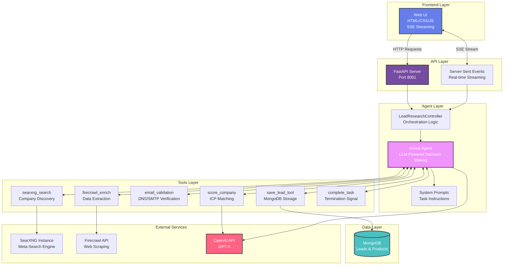
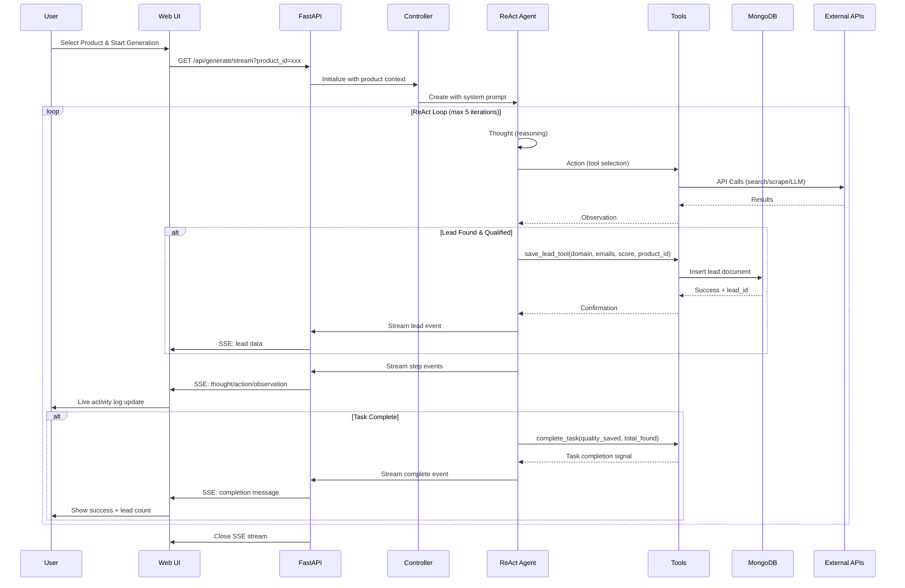
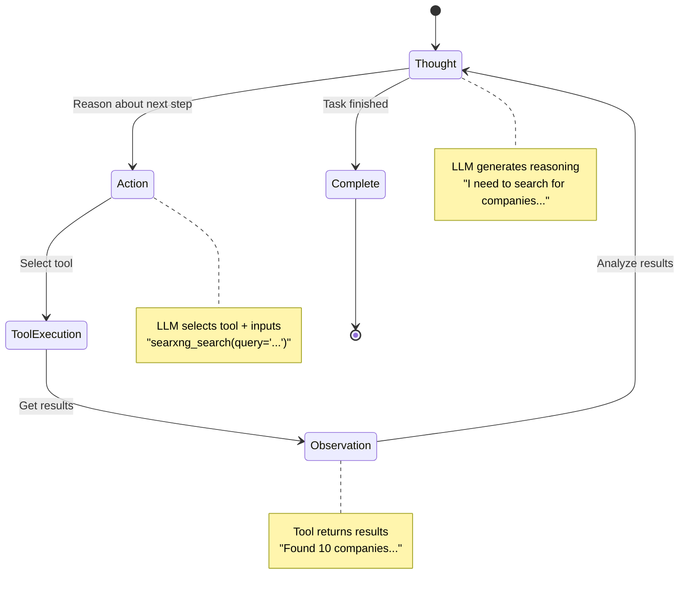
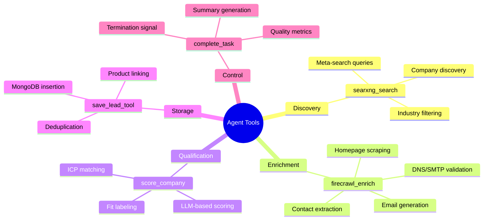
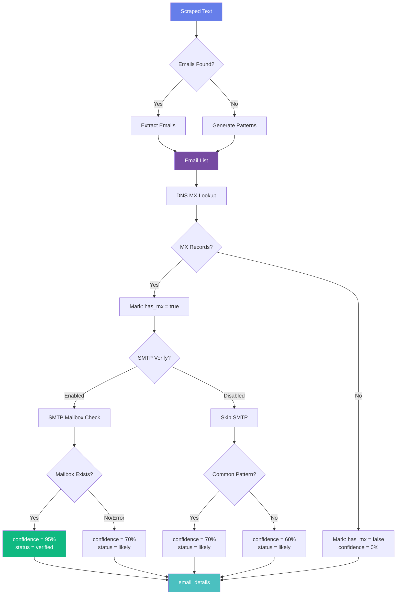
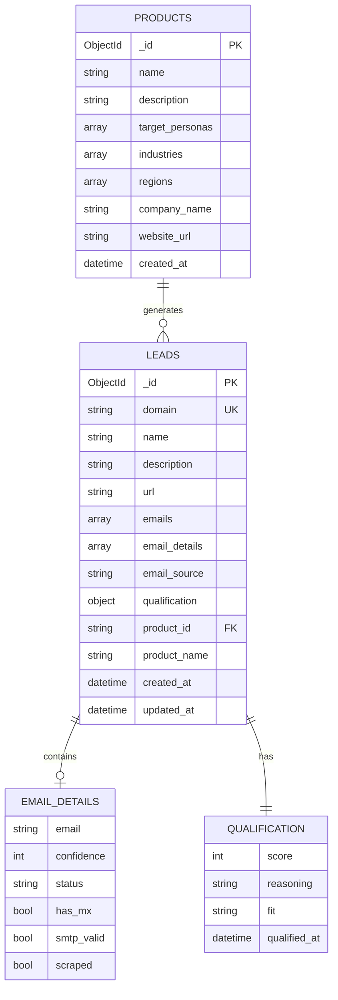
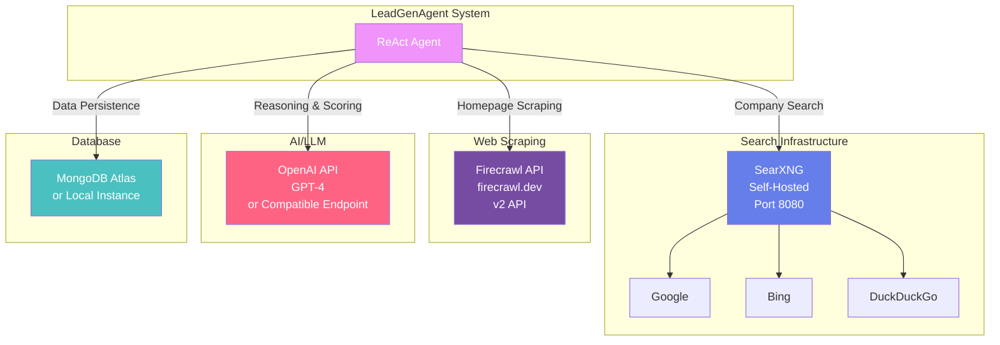
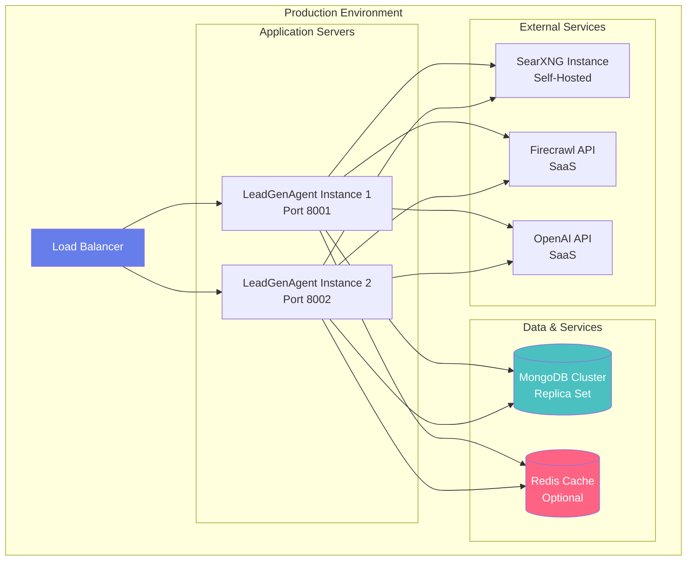

# 🏗️ LeadGenAgent - System Architecture

## Overview
AI-powered B2B lead generation system using ReAct agent pattern with real-time streaming capabilities.

---

## 🎯 High-Level Architecture



---

## 🔄 Data Flow Architecture



---

## 🗂️ Component Breakdown

### 1. **FastAPI Server** (`api/main.py`)
```mermaid
graph LR
    A[Request Handler] --> B[Product Endpoints]
    A --> C[Lead Generation]
    A --> D[Lead Retrieval]
    
    B --> B1[/api/products]
    B --> B2[/api/products/id]
    
    C --> C1[/api/generate/stream<br/>SSE Endpoint]
    
    D --> D1[/api/mongodb/leads]
    D --> D2[/api/leads/products]
    
    C1 --> E[LeadResearchController]
    
    style A fill:#667eea,color:#fff
    style C1 fill:#f093fb,color:#fff
    style E fill:#764ba2,color:#fff
```

**Key Features:**
- Server-Sent Events (SSE) for real-time streaming
- Product management CRUD operations
- Lead filtering by product, score, persona
- MongoDB integration via motor (async)

---

### 2. **ReAct Agent** (`agent/react_agent.py`)


**ReAct Pattern:**
1. **Thought**: LLM reasons about current state
2. **Action**: LLM chooses tool and parameters
3. **Observation**: Tool execution results
4. Repeat until `complete_task` called

---

### 3. **Tool Ecosystem**



---

### 4. **Email Validation Pipeline**



**Confidence Scoring:**
- **95%**: SMTP verified (mailbox confirmed)
- **70%**: DNS valid + common pattern (sales@, info@, contact@)
- **60%**: DNS valid only
- **0%**: No MX records (invalid domain)

---

## 💾 MongoDB Schema



---

## 🌐 External Dependencies



---

## 🔧 Technology Stack

| Layer | Technology | Purpose |
|-------|-----------|---------|
| **Frontend** | HTML5, CSS3, JavaScript | UI, SSE client, real-time updates |
| **Backend** | FastAPI (Python 3.13) | REST API, SSE streaming |
| **Agent Framework** | LangChain Core | Tool abstraction, LLM integration |
| **LLM** | OpenAI GPT-4 | Reasoning, decision-making, scoring |
| **Search** | SearXNG (Meta-search) | Company discovery |
| **Scraping** | Firecrawl API v2 | Homepage data extraction |
| **Email Validation** | dnspython, smtplib | DNS MX lookup, SMTP verification |
| **Database** | MongoDB (motor, pymongo) | Lead & product storage |
| **Server** | Uvicorn (ASGI) | Production server with auto-reload |

---

## 🚀 Deployment Architecture



---

## 📊 Performance Characteristics

- **Concurrent Users**: Supports multiple simultaneous lead generation sessions via SSE
- **Iteration Limit**: Max 5 ReAct iterations per generation (configurable)
- **Target Count**: 30 leads per run (configurable)
- **Streaming**: Real-time step-by-step progress via Server-Sent Events
- **Deduplication**: MongoDB unique index on `domain` field prevents duplicates
- **Email Validation**: ~100ms per email (DNS), ~2-5s (SMTP) - currently DNS-only for speed

---

## 🔒 Security Considerations

1. **API Keys**: Stored in `.env`, never committed
2. **CORS**: Configured for localhost during development
3. **Rate Limiting**: External API rate limits respected
4. **Input Validation**: Pydantic models validate all API inputs
5. **MongoDB**: Connection string with authentication
6. **SMTP Validation**: Respectful timeout limits to avoid abuse detection
